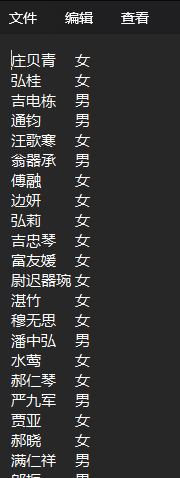
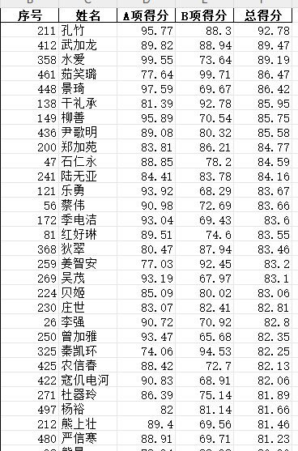
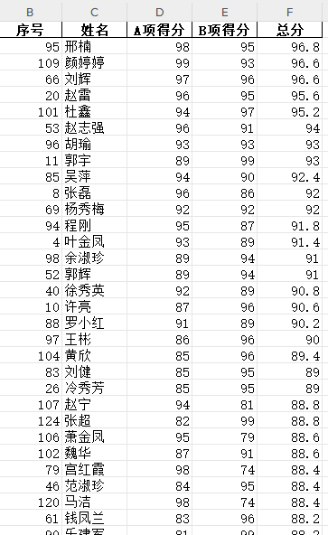

# TableGenerator

## Description

这是一个用于生成表格的小工具，可以根据需要模拟生成每一列数据，并导出到Excel（或其他）文件中。虽然现在AI可以辅助，但是一般难以满足需求，输出文本长度、表格质量受限，因此自己写了一个小工具，可以根据需要生成表格数据。

> 起因：
> 生成一份表格数据，要求如下:
> 
> 1、n个人参与，帮我生产每个人的A项得分、B项得分，并计算得出总得分 (总得分构成中A项为60%，B项为40%)。
> 
> 2、列名分别为序号、姓名、A项得分、B项得分、总得分
> 
> 3、A项、B项得分不应低于70分、不高于100分。
> 
> 4、将总成绩按高到底排序，
> 
> 5、直接输出表格，不少于n行，不要做省略

自己实现了一个名字随机生成器，用于生成随机的姓名。发现有一个项目Faker已经实现，遂将两种方式都用于生成表格。目前项目简单，后期根据需要持续更新。

## 结果预览

